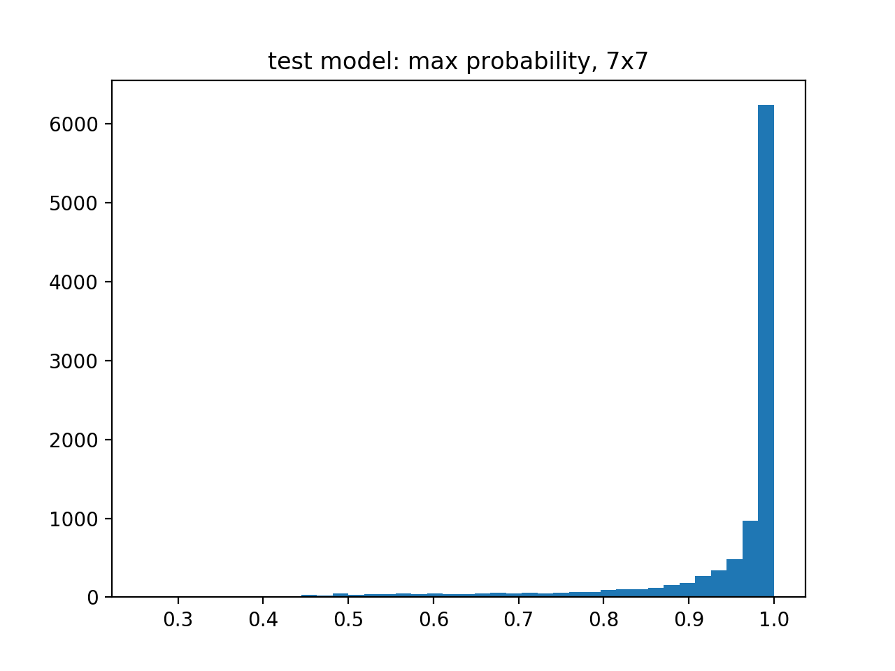
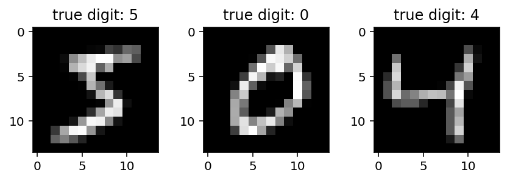
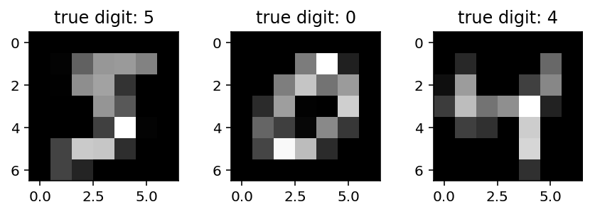
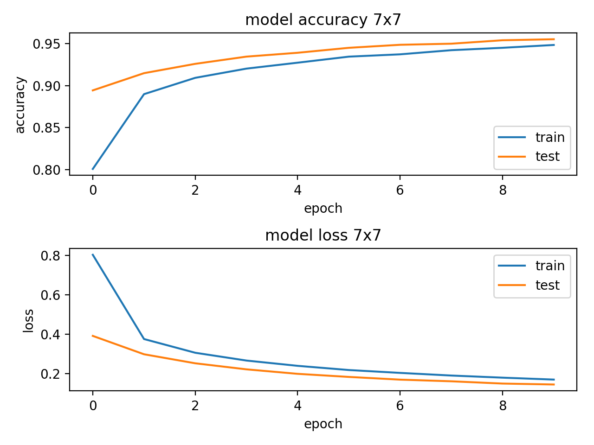
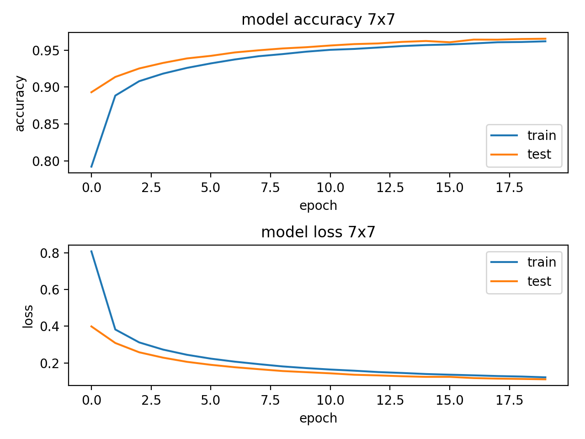

# Effect of resolution on performance on MNIST handwritten digits recognition

## Introduction

The main idea of this project is to carry out a recognition of handwritten digits from the MNIST dataset using coarse resolution 7x7 and use higher resolutions only in case if the degree of belief is below of some threshold value. This approach may be useful for time-critical applications like autonomous driving. 

The original black-and-white MNIST pictures come with resolution 28x28 pixels. 
The code creates copies of the dataset with resolution of 14x14 and 7x7 pixels. 

First, the code trains a simple Neural Network with one hidden layer for all three available resolution. The prediction procedure starts from the lowest resolution 7x7. If the softmax value is at least 0.95, the prediction is accepted. Otherwise, the prediction will use the picture with the finer resolution 14x14 pixels. If softmax value for 14x14 falls below 0.95, the finest resolution 28x28 pixels comes to play. 

The algorithm naively consider softmax value as a probability of truth, Bayesian degree of belief. The threshold value of 0.95 corresponds to confidence interval of two-sigma for Gaussian distribution. 

Example of softmax distribution for the resolution 7x7 pixels:

Below are the first three picture in different resolution.

## Results

The results are quite remarkable, see pictures/screen\_output.txt

The whole chain recognizes digits with probability of 98.1%. The coarsest resolution 7x7 is responsible for 75.5% of the true answers. The contribution of the next resolution 14x14 is about 15% and only in about 10% of samples the highest resolution 28x28 was needed. In other words, practically the coarsest resolution of 7x7 pixels was good for 3/4 of all pictures.

Emmanuel Ameisen from the Insight Artificial Intelligent Fellowship Program noticed that the test accuracy exceeds the train one. That may be explained by possible systematics in data selection (I did not shuffle the data). With larger number of epochs that difference washes out.

## Code structure

The module DataStore.py obtains the data and prepares pictures with degraded resolution of 14x14 and 7x7 pixels.

The module ModelRes.py uses Keras to build and trains the Neural Network model. 

The main module mnist\_resolution.py calls service modules and implements multi-step algorithm of prediction that starts from the coarse resolution 7x7 pixels and use finer resolution if the degree of belier falls out of 2-sigma confidence interval.

## Technical remarks

The code saves downgraded resolution pictures on disk in the directory result to save time for the following runs if they are presented in the directory. The models are also stored on the disk.

## Links

Author used excellent blog post "MNIST Handwritten Digit Recognition in Keras" by Gregor Koehler <https://nextjournal.com/gkoehler/digit-recognition-with-keras>
